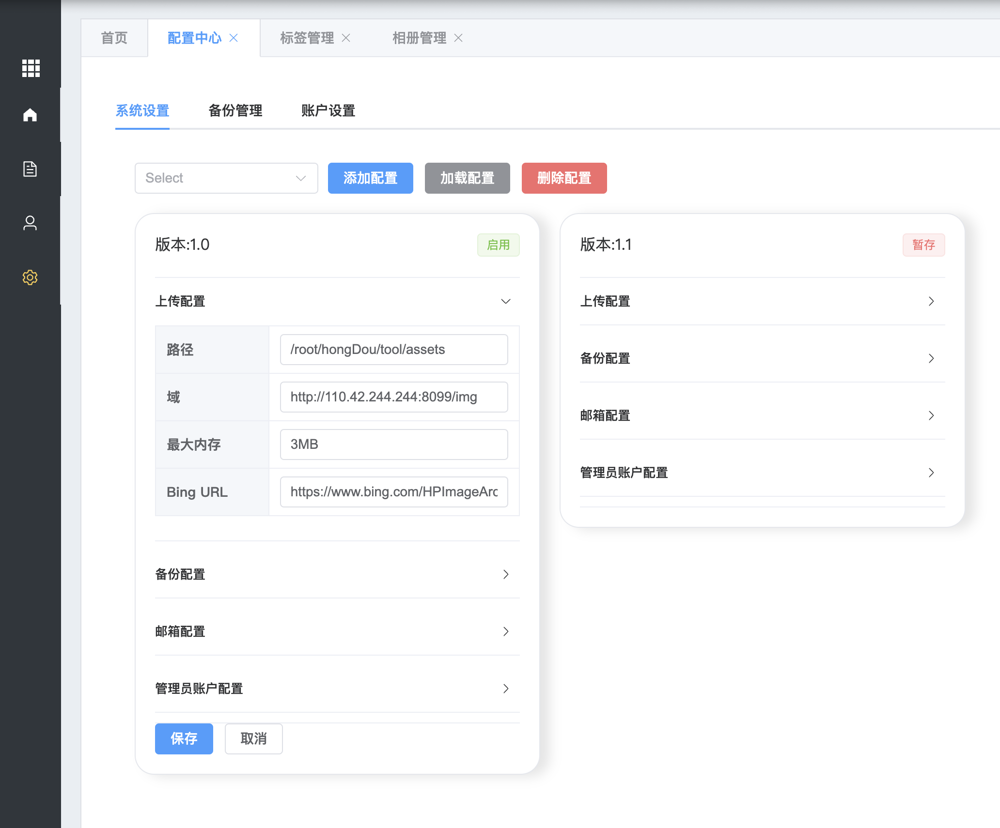

<div align="center">

# ⚡ Kratos-Blog
## 云原生微服务博客系统

<!-- Logo区域 -->
<picture>
  <source media="(prefers-color-scheme: dark)" srcset="https://img.shields.io/badge/⚡_KRATOS_BLOG-20232a?style=for-the-badge&logo=go&logoColor=00ADD8">
  <source media="(prefers-color-scheme: light)" srcset="https://img.shields.io/badge/⚡_KRATOS_BLOG-00ADD8?style=for-the-badge&logo=go&logoColor=white">
  
</picture>

<!-- 徽章区域 -->
<p align="center">
  
  
  
  
  
  
</p>

<!-- 简短描述 -->
**⚡ 基于 Golang & Kratos 构建的云原生微服务博客系统，支持容器化部署与弹性扩展**

<p align="center">
  <a href="https://lllcnm.cn"><strong>🌐 在线演示</strong></a> •
  <a href="#%E9%A1%B9%E7%9B%AE%E7%BB%93%E6%9E%84"><strong>📂 项目结构</strong></a> •
  <a href="#%E9%83%A8%E7%BD%B2%E6%96%B9%E5%BC%8F"><strong>🚀 部署指南</strong></a>
</p>

</div>

## 📂 项目结构

<div align="center">

### 🏗️ 微服务架构

| 服务名称 | 路径 | 描述 | 状态 |
|----------|------|------|------|
| 📝 **博文服务** | [`/app/blog`](./app/blog) | 文章管理、发布、搜索 | ✅ 已完善 |
| 💬 **评论服务** | [`/app/comment`](./app/comment) | 评论系统、回复功能 | ✅ 已完善 |
| 👤 **用户服务** | [`/app/user`](./app/user) | 用户管理、认证授权 | ✅ 已完善 |
| 🌐 **服务网关** | [`/app/gateway`](./app/gateway) | 统一入口、路由分发 | ✅ 已完善 |

### 🛠️ 其他模块

| 模块名称 | 路径 | 描述 |
|----------|------|------|
| 🔧 **工具模块** | [`/tool`](./tool/README.md) | 数据备份、导出、邮件服务 |
| 🎨 **管理后台** | [`/web/manager`](./web/manager) | Vue3 管理界面 |
| 🖥️ **展示前台** | [`/web/show`](./web/show) | Vue3 用户界面 |

</div>


## 🛠️ 技术栈

<div align="center">

| 分类 | 技术栈 | 徽章 |
|------|--------|------|
| **后端** | Golang + Kratos |   |
| **数据库** | MySQL + MongoDB |   |
| **缓存** | Redis |  |
| **消息队列** | RabbitMQ |  |
| **服务发现** | Consul |  |
| **前端** | Vue.js 3 |  |
| **认证** | JWT |  |

</div>
## 🚀 快速开始

### 📋 目录导航
- [🛠️ 技术栈](#️-技术栈)
- [📂 项目结构](#-项目结构)
- [🚀 部署方式](#-部署方式)
- [📸 软件截图](#-软件截图)
- [📞 联系作者](#-联系作者)

## 🐳 部署方式

<div align="center">

### 🚀 一键部署

Kratos-blog 支持多种部署方式，推荐使用 **Docker 容器化部署**。

</div>

### 📦 Docker 部署

#### 方案一：构建镜像
```bash
# 克隆项目
git clone https://github.com/ArtLjn/kratos-blog.git
cd kratos-blog/deploy

# 构建镜像（二选一）
# 使用 Ubuntu20 基础镜像
docker build -t blog:v1.1 -f DockerfileStart .

# 或使用项目提供的基础镜像
docker build -t blog:v1.1 -f DockerfileBase .
```

#### 方案二：拉取镜像
```bash
# 从 Docker Hub 拉取
docker pull ljnnb/blog:v1.1

# 国内镜像源（网络优化）
docker pull registry.cn-hangzhou.aliyuncs.com/ljn_docker_hub/blog:v1.1
```

#### 🚀 启动容器
```bash
# 创建数据卷（可选，持久化数据）
docker volume create blog-data

# 启动容器（端口映射完整）
docker run -d --name kratos-blog \
  -p 8033:8033 \
  -p 8036:8036 \
  -p 8080:8080 \
  -p 8500:8500 \
  -p 15762:15752 \
  -p 23306:3306 \
  -p 26379:6379 \
  -p 8099:8099 \
  -p 27017:27017 \
  -v blog-data:/data \
  blog:v1.1
```

#### 🔧 服务端口说明
| 端口 | 服务 | 说明 |
|------|------|------|
| 8033 | 网关服务 | API 统一入口 |
| 8036 | 用户服务 | 用户管理接口 |
| 8080 | 博文服务 | 文章管理接口 |
| 8500 | Consul | 服务发现与配置 |
| 23306 | MySQL | 主数据库 |
| 26379 | Redis | 缓存服务 |
| 27017 | MongoDB | 文档数据库 |
| 8099 | 管理后台 | Web 管理界面 |

> ⚙️ **配置提示**: 基础配置文件可通过管理平台配置中心实时修改
> 


## 📸 软件截图

<div align="center">

### 🎨 界面展示

| 管理后台 | 用户界面 |
|----------|----------|
|  |  |
|  |  |
|  |  |
|  |  |

### 📱 响应式设计

| 移动端适配 | 功能展示 |
|------------|----------|
|  |  |
|  |  |
|  |  |
|  |  |

</div>

---

## 📞 联系作者

<div align="center">

### 👨‍💻 开发者信息

<p align="center">
  
</p>

#### 📬 联系方式
- 💬 **微信**: 扫码上方二维码
- 🐙 **GitHub**: [项目地址](https://github.com/ArtLjn/kratos-blog)

#### ⭐ 支持项目
如果这个项目对你有帮助，请给个 ⭐ **Star** 支持一下！

</div>
