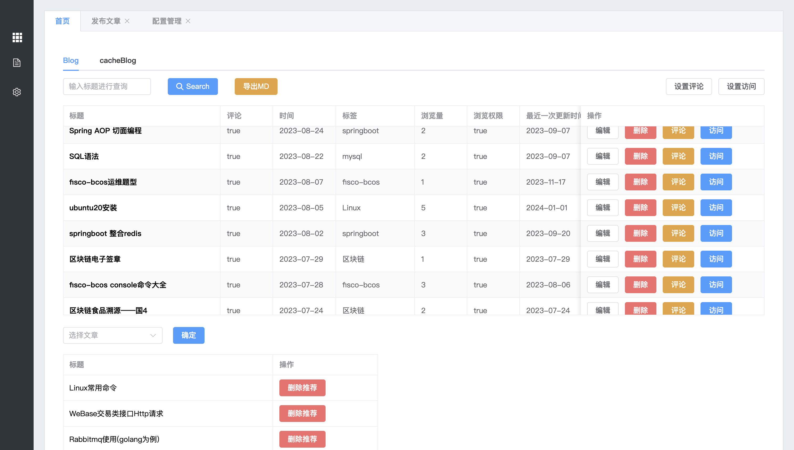
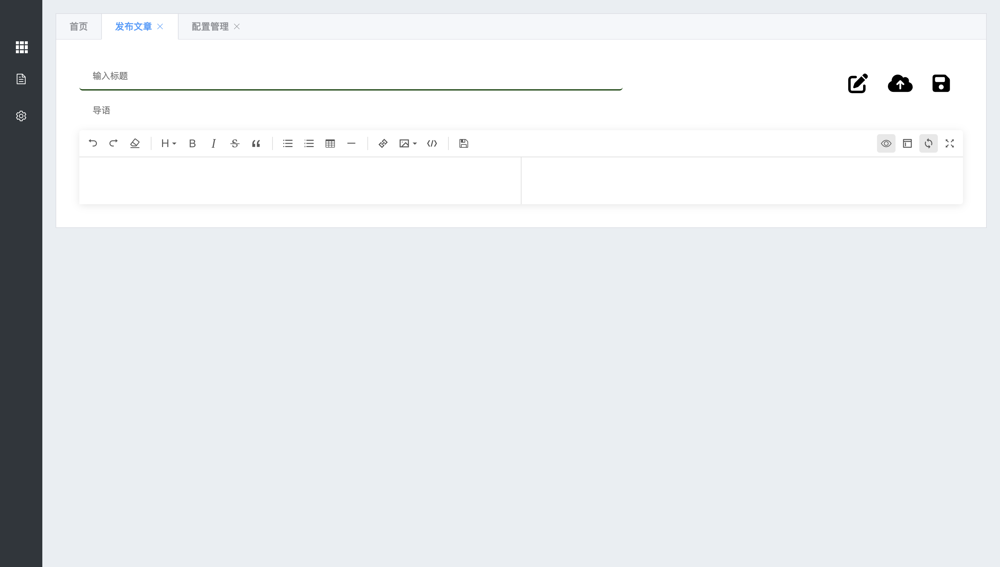
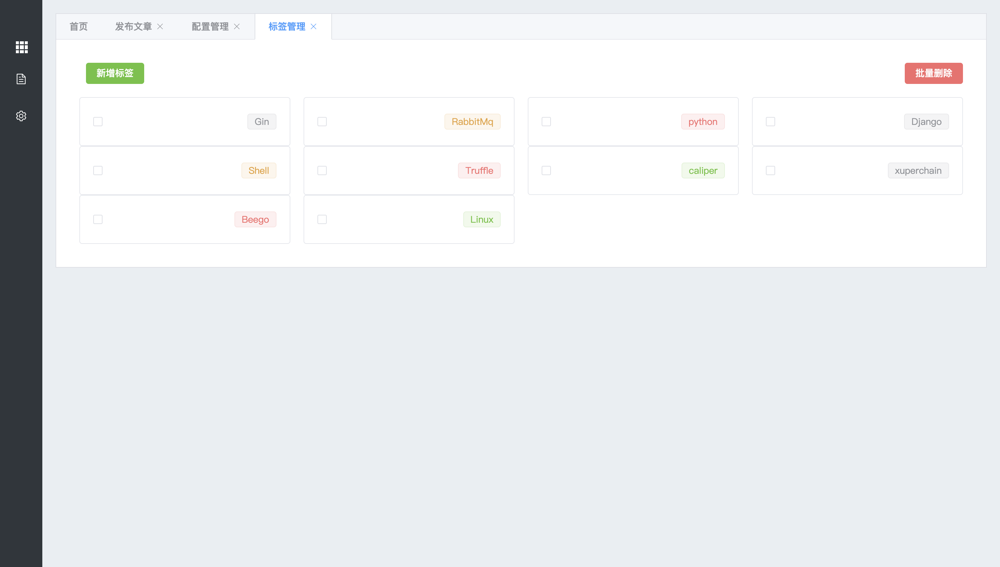
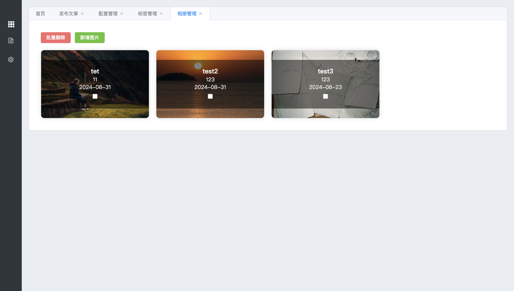
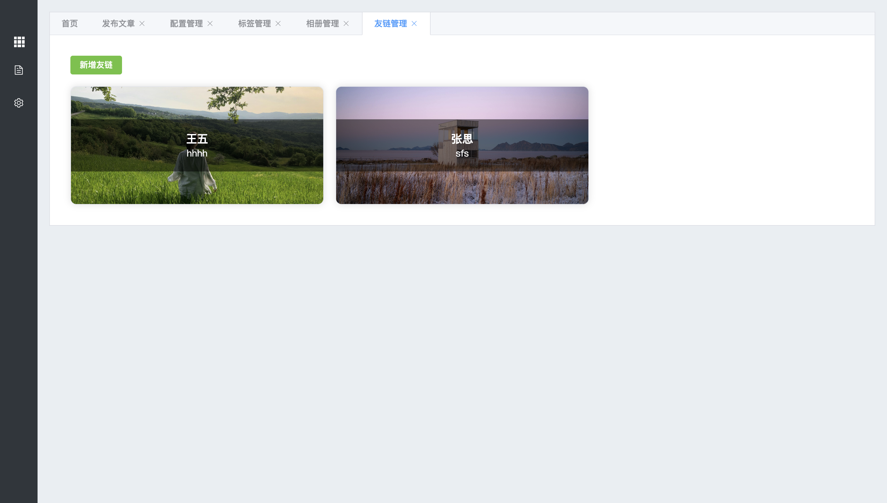
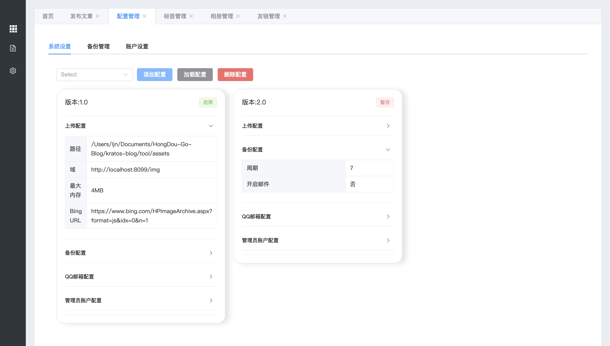
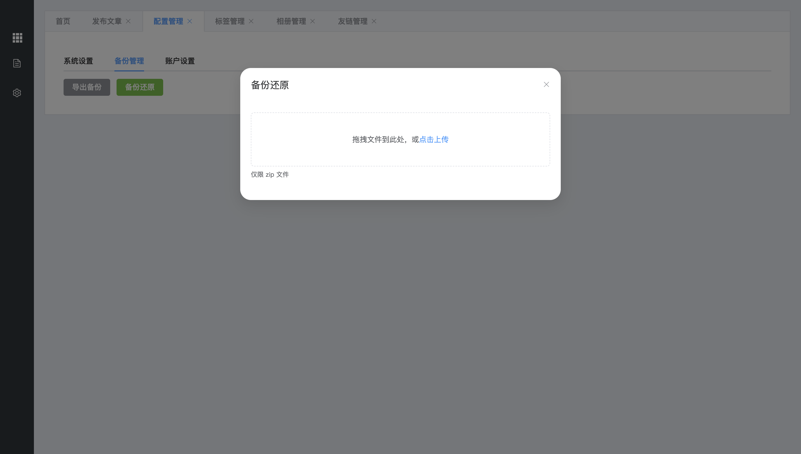

# Kratos-Blog 微服务博客系统
<div>


[](LICENSE)
</div>
一个基于Golang的微服务博客系统

- 后端基于 [golang](https://go.dev/) + [go-kratos](https://go-kratos.dev/)
- 前端基于 [VUE3](https://vuejs.org/) 
- [在线演示](https://lllcnm.cn)

## 项目结构 🧐

| 子项目名 | 项目路径                                      |
|------|-------------------------------------------|
| 博文服务 | [/kratos-blog/app/blog](./app/blog)       |
| 评论服务 | [/kratos-blog/app/comment](./app/comment) |
| 用户服务 | [/kratos-blog/app/user](./app/user)       |
| 服务网关 | [/kratos-blog/app/gateway](./app/gateway) |
| 工具模块 | [/kratos-blog/tool](./tool/README.md)     |
| 管理前台 | [/kratos-blog/web/manager](./web/manager) |
| 展现前台 | [/kratos-blog/web/show](./web/show)       |


## 技术栈使用
- 数据库: MySQL, MongoDB
- 缓存: Redis
- 消息队列: RabbitMQ
- 服务发现与配置: Consul
- Web 框架: Gin,Kratos
- 认证: JWT
## 部署方式

Kratos-blog 可以通过容器化的方式部署，支持 Docker，具体的部署步骤如下：

### 1. docker部署
- 使用Dockerfile一键构建镜像
``` bash
cd deploy
docker build -t blog:v1.1 -f DockerfileStart .
# 基于基础Blog镜像构建
docker build -t blog:v1.1 -f DockerfileBase .
```
- 直接拉去镜像
``` bash
docker pull ljnnb/blog:v1.1
# 若因网络原因请使用:
docker pull registry.cn-hangzhou.aliyuncs.com/ljn_docker_hub/blog:v1.1
```

- 部署好镜像之后构建容器
``` bash
# 创建容器卷(可选)
docker volume create blog
docker run -it --name=blog -p 8033:8033 -p 8036:8036 -p 8080:8080 -p 8500:8500 -p 15762:15752 -p 23306:3306 -p 26379:6379 -p 8099:8099 -p 27017:27017 -v blog:/root/hongDou -d blog:v1.1
```
注: 基础配置文件可进入容器之后自行修改

## 软件截图
<table>
    <tr>
        <td></td>
        <td></td>
    </tr>
    <tr>
        <td></td>
        <td></td>
    </tr>
    <tr>
        <td></td>
        <td></td>
    </tr>
    <tr>
        <td></td>
        <td></td>
    </tr>
    <tr>
        <td></td>
        <td></td>
    </tr>
    <tr>
        <td></td>
        <td></td>
    </tr>
     <tr>
        <td></td>
        <td></td>
    </tr>
   <tr>
        <td></td>
        <td></td>
    </tr>
</table>


### 联系作者
</td>